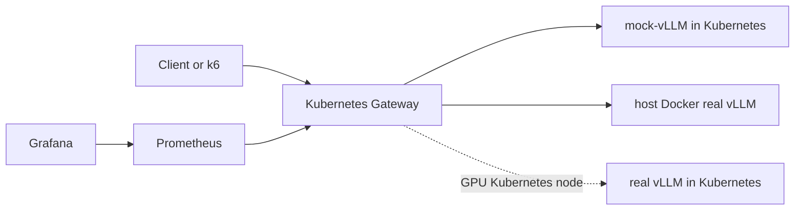

# Cloud Native LLM Inference Platform

A Kubernetes-based LLM inference platform demo with an OpenAI-compatible Gateway, API key authentication, per-key rate limiting, Prometheus metrics, Grafana dashboards, and k6 benchmark reports.

The project supports two backend modes:

- Mock mode: Gateway forwards to an OpenAI-compatible mock vLLM service inside Kubernetes.
- Real mode: Gateway forwards to real vLLM serving `facebook/opt-125m`. On this local kind setup, real vLLM runs in Docker on the host because the kind node does not expose `nvidia.com/gpu`.

## Features

- OpenAI-compatible `POST /v1/chat/completions`
- `GET /healthz` health check
- `GET /metrics` Prometheus metrics endpoint
- Bearer API key authentication
- In-memory per-key rate limiting
- Configurable upstream vLLM base URL
- Mock vLLM backend for CPU-only Kubernetes testing
- Real vLLM backend with Docker GPU runtime
- Kubernetes manifests for Gateway, mock backend, real backend, Prometheus, and Grafana
- k6 benchmark script and benchmark report

## Architecture



Local hybrid real-vLLM path used on this machine:

```text
Client -> 127.0.0.1:8081 -> K8s Gateway -> host.docker.internal:8000 -> Docker vLLM
                                      |
                                      v
                                Prometheus -> Grafana
```

More detail: [docs/architecture.md](docs/architecture.md)

## Project Layout

```text
gateway/       FastAPI inference gateway
mock-vllm/     OpenAI-compatible mock backend
k8s/           Kubernetes overlays for mock and real vLLM
monitoring/    Prometheus and Grafana manifests
benchmark/     k6 chat-completions load test
configs/       vLLM runtime config, including OPT chat template
docs/          Architecture, runbook, and benchmark report
scripts/       PowerShell scripts for local and Kubernetes workflows
```

## Quick Demo

Prerequisites:

- Docker Desktop running
- kind cluster named `llm-platform`
- `kubectl` configured for that cluster
- `vllm/vllm-openai:latest` available locally
- NVIDIA GPU available to Docker Desktop for real vLLM

Run host Docker real vLLM:

```powershell
cd C:\Users\HP\llm-inference-platform
.\scripts\start-real-vllm-docker.ps1
```

Configure the Kubernetes Gateway for the final hybrid demo:

```powershell
.\scripts\configure-hybrid-real-vllm.ps1
kubectl -n llm-platform port-forward svc/gateway 8081:8080
```

In another PowerShell window, run the smoke test:

```powershell
Invoke-RestMethod -Method Get -Uri "http://127.0.0.1:8081/healthz"

$body = @{
  model = "facebook/opt-125m"
  messages = @(@{ role = "user"; content = "Say hello in one short sentence." })
  max_tokens = 64
} | ConvertTo-Json -Depth 5

Invoke-RestMethod `
  -Method Post `
  -Uri "http://127.0.0.1:8081/v1/chat/completions" `
  -Headers @{ Authorization = "Bearer sk-demo" } `
  -ContentType "application/json" `
  -Body $body

Invoke-WebRequest -Uri "http://127.0.0.1:8081/metrics" -UseBasicParsing |
  Select-Object -ExpandProperty Content |
  Select-String -Pattern "gateway_requests_total|gateway_upstream_requests_total"
```

Run the same demo flow with a short k6 benchmark:

```powershell
$env:VUS="1"
$env:DURATION="20s"
$env:BENCHMARK_NAME="k6-k8s-hybrid-real-vllm-final-demo"
.\scripts\run-k8s-benchmark.ps1
```

## Manual Real-vLLM Hybrid Mode

Start real vLLM on the host:

```powershell
.\scripts\start-real-vllm-docker.ps1
.\scripts\check-vllm.ps1
```

Configure the Kubernetes Gateway:

```powershell
.\scripts\configure-hybrid-real-vllm.ps1
```

Port-forward Gateway:

```powershell
kubectl -n llm-platform port-forward svc/gateway 8081:8080
```

Test chat completions:

```powershell
$body = @{
  model = "facebook/opt-125m"
  messages = @(@{ role = "user"; content = "Say hello in one short sentence." })
  max_tokens = 32
} | ConvertTo-Json -Depth 5

Invoke-RestMethod `
  -Method Post `
  -Uri "http://127.0.0.1:8081/v1/chat/completions" `
  -Headers @{ Authorization = "Bearer sk-demo" } `
  -ContentType "application/json" `
  -Body $body
```

Check metrics:

```powershell
Invoke-WebRequest -Uri "http://127.0.0.1:8081/metrics" -UseBasicParsing |
  Select-Object -ExpandProperty Content |
  Select-String -Pattern "gateway_requests_total|gateway_upstream_requests_total"
```

## Mock Kubernetes Mode

Use this mode when no GPU is available.

Build images and deploy mock stack:

```powershell
docker compose up -d --build
kind load docker-image llm-platform-gateway:0.1.0 --name llm-platform
kind load docker-image llm-platform-mock-vllm:0.1.0 --name llm-platform
.\scripts\deploy-mock-k8s.ps1
```

Expose the Gateway:

```powershell
.\scripts\port-forward-k8s-gateway.ps1
```

## Monitoring

Deploy Prometheus and Grafana:

```powershell
.\scripts\deploy-monitoring.ps1
```

Expose monitoring locally:

```powershell
.\scripts\port-forward-monitoring.ps1
```

URLs:

```text
Prometheus: http://127.0.0.1:9090
Grafana:    http://127.0.0.1:3000
Login:      admin / admin
```

## Benchmark

Run the validated hybrid real-vLLM baseline:

```powershell
$env:VUS="1"
$env:DURATION="20s"
$env:BENCHMARK_NAME="k6-k8s-hybrid-real-vllm-baseline"
$env:MODEL="facebook/opt-125m"
.\scripts\run-k8s-benchmark.ps1
```

Current benchmark summary:

| Scenario | Requests | Success Rate | Avg Latency | P95 Latency | RPS |
| --- | ---: | ---: | ---: | ---: | ---: |
| K8s Gateway -> mock vLLM | 20 | 100.00% | 42.07 ms | 74.72 ms | 0.96 |
| K8s Gateway -> host Docker real vLLM | 17 | 100.00% | 184.27 ms | 273.81 ms | 0.88 |

Full report: [docs/benchmark-report.md](docs/benchmark-report.md)

## Kubernetes State

For this local kind environment:

- `gateway`, `prometheus`, and `grafana` should be running.
- `mock-vllm` should be scaled to `0` in hybrid real-vLLM mode.
- in-cluster `vllm` should be scaled to `0` because this kind node does not expose `nvidia.com/gpu`.
- `service/vllm` has no endpoint in hybrid mode; Gateway uses `host.docker.internal:8000` directly.

Reset to the clean hybrid state:

```powershell
.\scripts\reset-k8s-hybrid-state.ps1
```

## Real vLLM In Kubernetes

The real-vLLM manifests are in:

```text
k8s/real-vllm
```

They are intended for a Kubernetes node that exposes `nvidia.com/gpu`. On the current local kind cluster, the Pod remains Pending with:

```text
Insufficient nvidia.com/gpu
```

Use the hybrid mode above for the local demo. Use `k8s/real-vllm` on a GPU-enabled Kubernetes node.

## Key Files

- [gateway/app/main.py](gateway/app/main.py): Gateway routes, forwarding, and metrics middleware
- [gateway/app/auth.py](gateway/app/auth.py): Bearer token validation
- [gateway/app/rate_limit.py](gateway/app/rate_limit.py): per-key rate limiter
- [configs/opt-chat-template.jinja](configs/opt-chat-template.jinja): chat template for `facebook/opt-125m`
- [docs/real-vllm-runbook.md](docs/real-vllm-runbook.md): real-vLLM runbook
- [docs/benchmark-report.md](docs/benchmark-report.md): benchmark results
