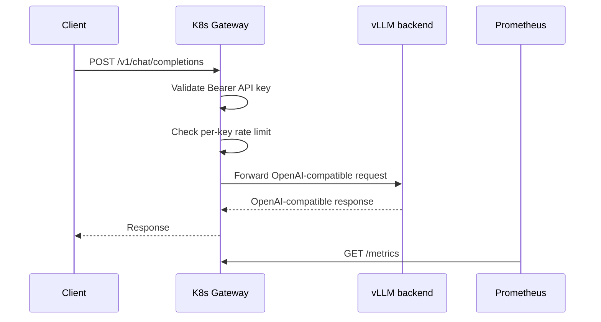

# Architecture

This project is a compact cloud-native LLM inference platform. It separates the public API Gateway from the model backend so the same Gateway can route to a mock backend, host Docker vLLM, or in-cluster vLLM.

## Components

| Component | Location | Purpose |
| --- | --- | --- |
| Gateway | `gateway/`, `k8s/*/gateway-*` | OpenAI-compatible API, API key auth, rate limiting, upstream forwarding, metrics |
| mock-vLLM | `mock-vllm/`, `k8s/mock` | CPU-friendly OpenAI-compatible backend for Kubernetes validation |
| real vLLM | Docker host or `k8s/real-vllm` | Real model serving through `vllm/vllm-openai` |
| Prometheus | `monitoring/prometheus.yaml` | Scrapes Gateway metrics |
| Grafana | `monitoring/grafana.yaml` | Visualizes Gateway metrics |
| k6 | `benchmark/k6-chat.js` | Load test for `/v1/chat/completions` |

## Request Flow



## Deployment Modes

### Mock Mode

```text
Client -> K8s Gateway -> K8s mock-vLLM
```

Use this for CPU-only Kubernetes validation. The mock service returns OpenAI-compatible responses without running a model.

### Hybrid Real-vLLM Mode

```text
Client -> K8s Gateway -> host.docker.internal:8000 -> Docker vLLM
```

Use this on local kind when Docker Desktop can access the GPU but the kind node does not expose `nvidia.com/gpu`.

Validated on 2026-07-08 with:

- model: `facebook/opt-125m`
- Gateway upstream: `http://host.docker.internal:8000`
- benchmark: 17 requests, 100% success, P95 273.81 ms

### In-Cluster Real-vLLM Mode

```text
Client -> K8s Gateway -> K8s real vLLM
```

Use this on a GPU-enabled Kubernetes node. The manifests exist in `k8s/real-vllm`, but the current local kind node does not advertise `nvidia.com/gpu`, so the real vLLM Deployment is scaled to `0` for the local demo.

## Metrics

The Gateway exposes:

```text
gateway_requests_total{method,path,status_code}
gateway_upstream_requests_total{model,status_code}
gateway_request_latency_seconds{method,path}
```

These metrics are enough to show request volume, status-code distribution, upstream status, and Gateway latency.
